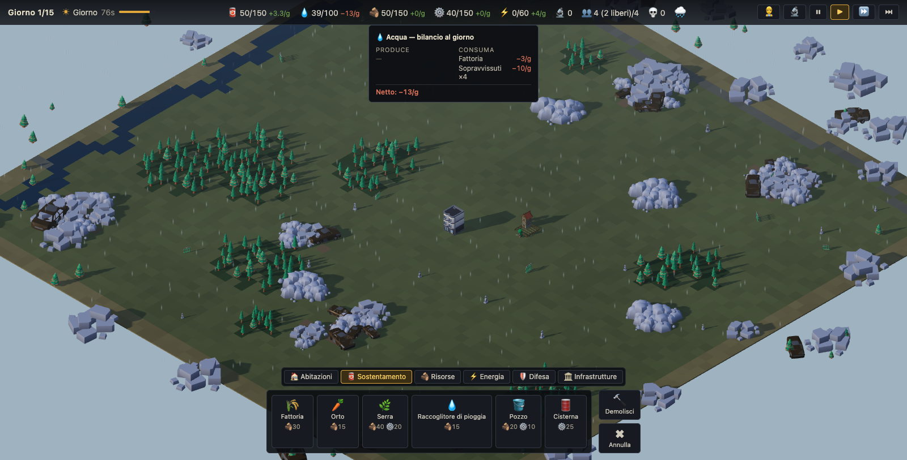

# City Builder Survival

A post-apocalyptic city builder for the browser: by day you build and manage
your colony, by night hordes of zombies attack. **Endless** mode: there is no
victory — survive as long as you can.

Built with [Vite](https://vite.dev) + [Three.js](https://threejs.org), with no
UI framework: a full-screen WebGL canvas and a minimal DOM overlay.



## Getting started

```bash
npm install
npm run dev
```

then open http://localhost:5173 in your browser.

Progress is saved automatically to `localStorage` at every dawn; add `?new=1`
to the URL to start over and `?seed=N` for a specific map.

## Controls

| Input | Action |
| --- | --- |
| `W A S D` / arrow keys | move the camera |
| Mouse wheel | zoom |
| `Q` / `E` | rotate the camera by 90° |
| Left click | place the selected building / demolish (in demolish mode) |
| Left-drag | with a wall or road selected, place a row along the dominant axis |
| `R` | rotate the ghost building during placement |
| Right click / `ESC` | cancel placement or demolition |
| `Space` | pause / resume |
| `1` / `2` / `3` | game speed |
| 🔍 button (HUD) | show/hide the site yield under wells, hunting and fishing cabins, and ranches |
| 🔄 button (HUD) | restart the run (with confirmation) |
| `seed #N` label (bottom right) | copy the map link to the clipboard |

## Goal and rules

- **Survive as long as possible.** If the Refuge (HQ) falls or every survivor
  dies, the run is lost: your score is the number of nights survived.
- Manage four resources: **food** (survivors eat every day — starvation
  kills), **materials** (needed to build), **energy** (powers the defenses)
  and **fuel** ⛽ (keeps the settlement's vehicles on the road).
- By **day** you build: tents and houses for beds, farms for food, **wells**
  for water (passive, no workers: they yield more near water), **hunting and
  fishing cabins** (they yield more near forest and water), salvage yards for
  materials, solar panels for energy (they only produce by day; the Refuge
  generator covers the night). The map also hides small inland ponds and
  herds of wild animals.
- The **Distillery** 🛢️ turns wood into fuel and the **Garage** 🚗 burns it:
  as long as it is staffed, extraction yields 50% more (effect does not
  stack). **Roads** 🛣️ are built with wood and can also be placed by dragging
  the mouse, like walls; each road increases extraction by 2% (up to +40%).
  Idle survivors trace **dirt paths** from the Refuge to buildings on their
  own (one tile every 10 seconds, up to 100 tiles): each path tile adds
  another +0.5% to extraction (up to +15%).
- The **Ranch** 🐄 produces food from wild **herds**: it yields the most near
  a herd (you'll find them on the map; zombies walk right through them) and
  half elsewhere. As long as it is staffed, working animals boost farms by
  15% and extraction by 10% per ranch (up to +45%/+30%).
- By **night** the zombies come: **barricades** slow them down, **watch
  towers** fire automatically but require energy (⚡ 1) and a worker. Staffed
  buildings defend themselves (short-range rifles, no energy cost) and idle
  survivors garrison the Refuge. Beware: if a zombie **destroys a building,
  its workers die** — when a staffed building is under attack you get a
  warning; switch it off (⏻) or unassign its workers to get them to safety at
  the Refuge. Each night the horde grows larger (the growth tapers off past
  night 12).
- Grid energy also powers three support buildings (global aura, does not
  stack, only active on a charged grid): the **Field Spotlight** 🔦 (towers
  +20% damage), the **Street Lamp** 💡 (garrisons and militia +25% damage)
  and the **Electric Motor** 🔌 (extractors +25%).
- Damaged buildings smoke and darken; a smoke column marks the losses over
  the rubble. New recruits arrive at dawn if there are free beds and enough
  food and water: one extra per staffed **Emergency Radio** and one extra
  every 25 **reputation** ⭐ points. Reputation (0–100, always visible in the
  top bar) grows by 4 every survived night and by 2 per staffed Radio, but
  drops by 10 for every dead survivor.
- Damaged buildings can be **repaired** from the inspector (🔧): the cost is
  proportional to the damage (a full repair costs half the construction) and
  hp recover over 30 seconds.
- Every building can be **switched off** from the inspector (⏻): while off it
  is inert (no production, consumption or fire) and its workers are freed;
  beds and capacity bonuses stay active.
- From the 👷 Workers panel you can set each building's **priority**
  (▼/●/▲): all else being equal, high-priority buildings get staff first.
- Producers, extractors and towers can be **upgraded** from the inspector
  (⬆, up to ★3): each level increases yield and max hp by 50%.
- The **day's weather** is always visible in the top bar (icon and name); the
  tooltip summarizes its effects on production, thirst and defenses.
- The 🔍 button turns on the **site yield overlay**: a green disk under
  wells, hunting and fishing cabins and ranches that yield the most, yellow
  where the yield is reduced (same colors as the placement ghost).
- When placing a **tower** — or selecting an existing one — a ring shows its
  effective firing range.
- **Walls** and **roads** can also be placed by dragging the mouse: the row
  follows the dominant axis, the preview shows tile by tile where you can
  build, and placement stops at the first blocked tile or when materials run
  out.
- Your best nights survived are saved as a **record**, shown on the title
  screen and on the defeat screen. The map **seed** is always visible in the
  bottom right corner: one click copies the shareable link.

## Code structure

- `src/core/` — engine: renderer/scene, isometric camera, input, day/night
  cycle, particle effects (`fx.js`), synthesized audio (`audio.js`)
- `src/world/` — logical grid, map generation, 3D terrain, site yield overlay
  and tower range (`overlay.js`)
- `src/sim/` — pure simulation (no DOM/three.js): state, economy, survivors,
  waves
- `src/buildings/` — building definitions, placement, visuals and damage
- `src/zombies/` — zombie manager, pathfinding, tower combat
- `src/assets/` — GLB model loader
- `src/ui/` — HUD, build menu, screens (title/defeat)
- `public/assets/` — GLB models and manifest
- `tests/` — Vitest tests on the simulation and definitions

## Tests

```bash
npm test
```

## Production build

```bash
npm run build
```

the static output goes to `dist/` (`npm run preview` to try it locally).

## Credits

The 3D models are by Kenney, KayKit and Quaternius (CC0 / CC-BY): full list,
licenses and attributions in [CREDITS.md](CREDITS.md). The audio is entirely
synthesized via WebAudio — no external files.

## License

The code is released under the [MIT License](LICENSE). The 3D assets remain
the property of their respective authors and are distributed under their own
licenses (CC0 / CC-BY 3.0) — see [CREDITS.md](CREDITS.md).
