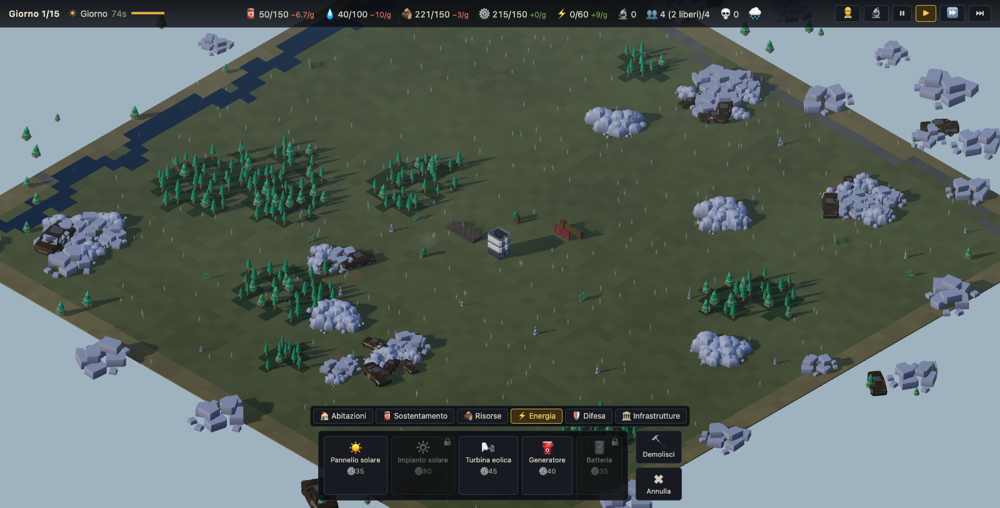
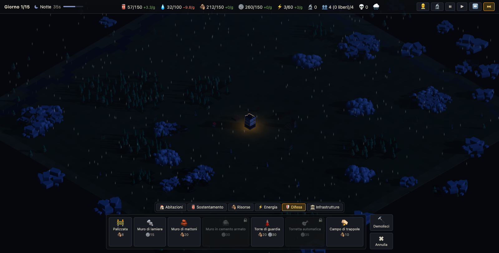
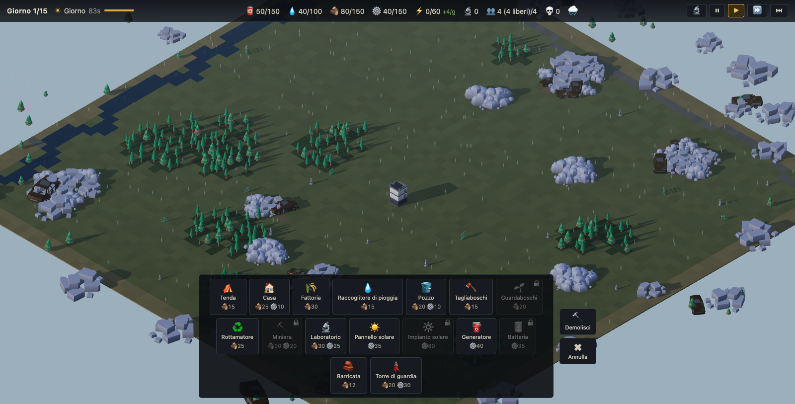

# Last Refuge

**Build by day. Survive the horde by night.**

**▶ Play online: https://d590900.github.io/city-builder-survival/**

A post-apocalyptic city builder for the browser, built with
[Vite](https://vite.dev) + [Three.js](https://threejs.org), with no UI
framework: a full-screen WebGL canvas and a minimal DOM overlay.

- **Build by day, survive by night** — grow your colony in daylight, hold the
  line against the zombie horde after dark.
- **Six-resource economy** — food, water, materials, wood, energy and fuel,
  with workers to assign and per-building priorities.
- **Research tree, weather and upgrades** — unlock new options, adapt to the
  day's weather and upgrade buildings up to ★3.
- **Shareable map seeds and endless mode** — no victory, just how long you
  last; your record of nights survived is saved locally.

## Screenshots

| | |
| --- | --- |
|  |  |
|  |  |

Full gameplay rules: [docs/GAMEPLAY.md](docs/GAMEPLAY.md)

## Local development

```bash
npm install
npm run dev
```

then open http://localhost:5173 in your browser.

Progress is saved automatically to `localStorage` at every dawn; add `?new=1`
to the URL to start over and `?seed=N` for a specific map.

## Controls

| Input | Action |
| --- | --- |
| `W A S D` / arrow keys | move the camera |
| Mouse wheel | zoom |
| `Q` / `E` | rotate the camera by 90° |
| Left click | place the selected building / demolish (in demolish mode) |
| Left-drag | with a wall or road selected, place a row along the dominant axis |
| `R` | rotate the ghost building during placement |
| Right click / `ESC` | cancel placement or demolition |
| `Space` | pause / resume |
| `1` / `2` / `3` | game speed |
| 🔍 button (HUD) | show/hide the site yield under wells, hunting and fishing cabins, and ranches |
| 🔄 button (HUD) | restart the run (with confirmation) |
| `seed #N` label (bottom right) | copy the map link to the clipboard |

## Code structure

- `src/bootstrap.js` — boot, asset loading, URL params
- `src/persistence.js` — save/record in `localStorage`
- `src/core/` — engine: renderer/scene, isometric camera, input, day/night
  cycle, particle effects (`fx.js`), synthesized audio (`audio.js`)
- `src/game/phase-controller.js` — day/night transitions
- `src/world/` — logical grid, map generation, 3D terrain, site yield overlay
  and tower range (`overlay.js`)
- `src/sim/` — pure simulation (no DOM/three.js): state, economy, survivors,
  waves
- `src/buildings/` — building definitions, placement, visuals and damage
- `src/zombies/` — zombie manager, pathfinding, tower combat
- `src/assets/` — GLB model loader
- `src/ui/` — HUD, build menu, screens (title/defeat), first-run guided
  tutorial (`tutorial.js`)
- `public/assets/` — GLB models and manifest
- `tests/` — Vitest tests on the simulation and definitions

## Tests

```bash
npm test
```

## Production build

```bash
npm run build
```

the static output goes to `dist/` (`npm run preview` to try it locally).

## Credits

The 3D models are by Kenney, KayKit and Quaternius (CC0 / CC-BY): full list,
licenses and attributions in [CREDITS.md](CREDITS.md). The audio is entirely
synthesized via WebAudio — no external files.

## License

The code is released under the [MIT License](LICENSE). The 3D assets remain
the property of their respective authors and are distributed under their own
licenses (CC0 / CC-BY 3.0) — see [CREDITS.md](CREDITS.md).
